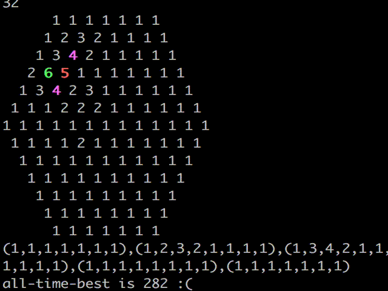

# azpcs
http://azspcs.com/Contest/HexagonalNeighbors this shit is sick

## Hexagonal Neighbors

Ended up getting a relative score of 20.3454 out of a total possible 25, which was good for 187th place out of 372.  Just did some shitty local search algorithms.  Discussion of the actual best solutions is here https://groups.yahoo.com/neo/groups/AlZimmermannsProgrammingContests/conversations/topics/4435 (starting at feb 2, 2019) [Tomas Rokicki's writeup](https://tomas.rokicki.com/hex/) and [Tom Sirgedas's writeup](https://docs.google.com/document/d/14VabEUKKoJ_GF2t7byo76zGOeTiiDFme8ewxqZtuVr4/edit)

